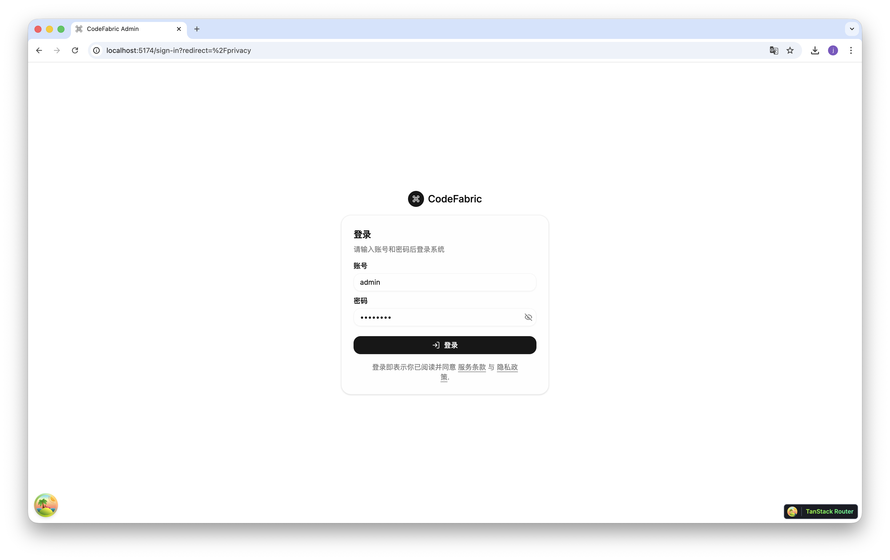
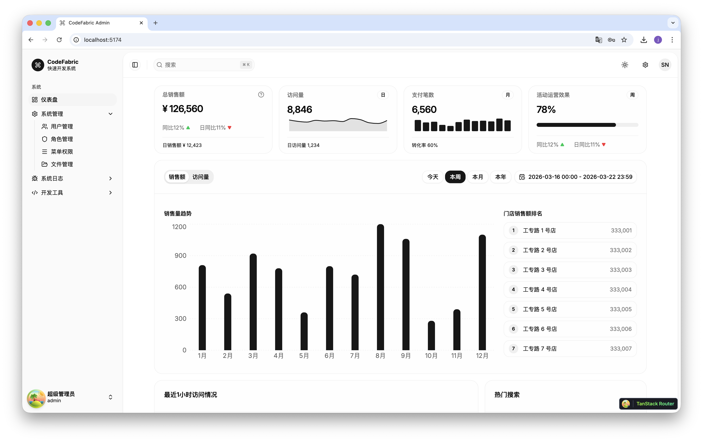
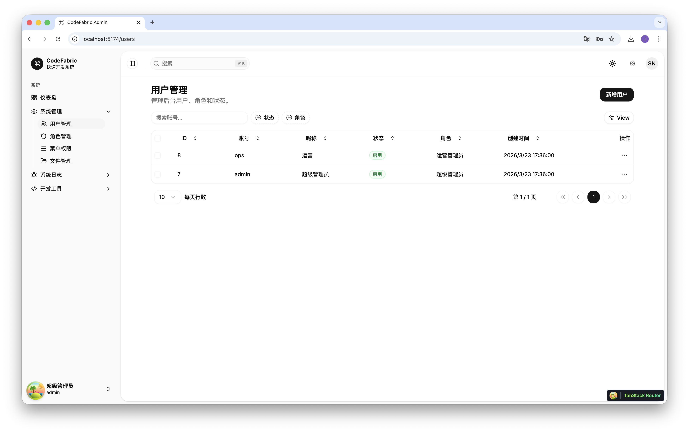
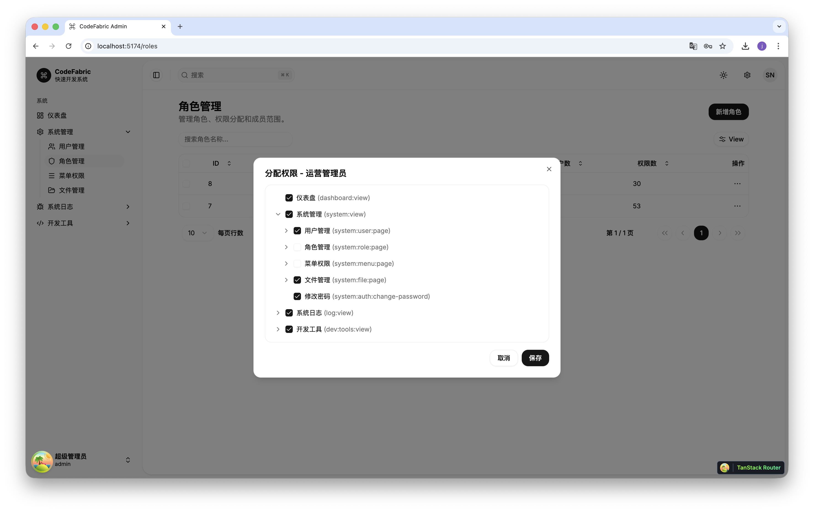
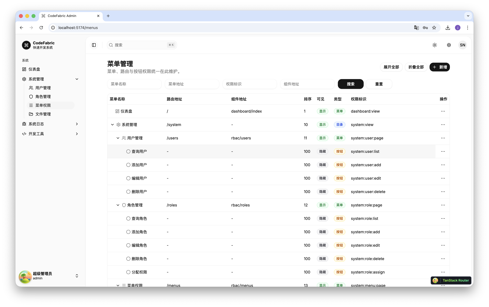
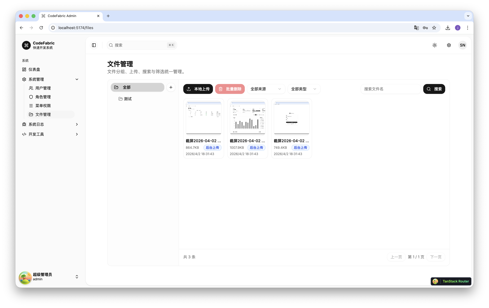
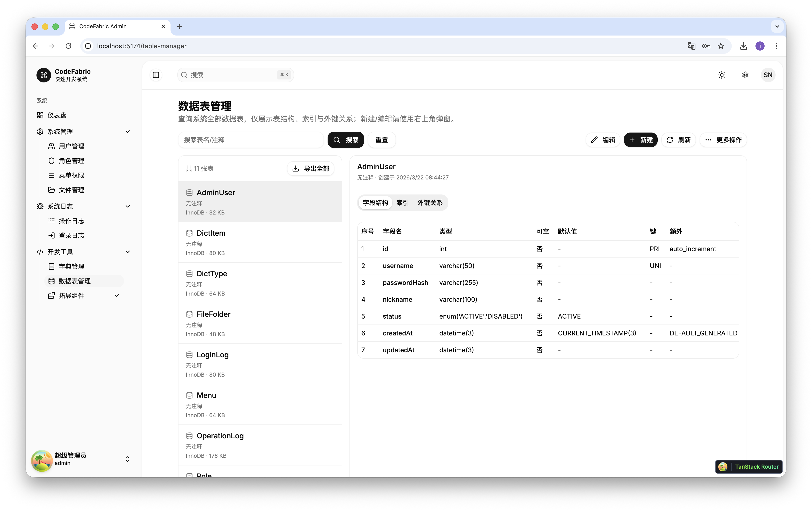
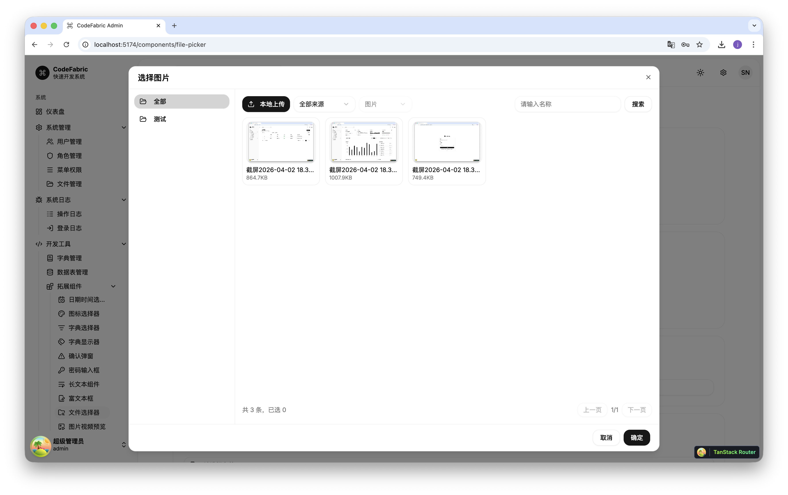

# CodeFabric

CodeFabric 是一个面向企业后台场景的全栈管理系统，核心能力覆盖 RBAC、日志审计、文件管理、字典管理与数据表管理。
## 演示截图










## 技术栈

- 前端：React + TypeScript + Vite + TanStack + shadcn/ui
- 后端：Laravel 12（PHP 8.4）+ MySQL + Redis（可选）
- 鉴权：JWT（`firebase/php-jwt`）+ Cookie
- 文档：OpenAPI（Swagger）

## 当前目录

```text
meme/
├─ frontend/          # 管理端前端
├─ backend-laravel/   # Laravel 后端
```

## 后端架构（DDD Lite）

`backend-laravel/app` 采用模块化分层：

- `Attributes`：声明式注解（鉴权、日志、事务、锁）
- `CrossCutting`：注解执行器（Handler）
- `Modules/Admin/*`：业务模块（Application / Domain / Http / Infrastructure）
- `Models`：Eloquent 模型（仅 ORM 映射）
- `Support` / `Shared`：通用基础能力

业务链路：

`Controller -> ApplicationService -> RepositoryInterface -> EloquentRepository -> Model`

## 主要功能

- 认证与权限：登录、退出、修改密码、用户/角色/菜单权限控制
- 审计能力：登录日志、操作日志（请求/响应/耗时/操作者）
- 文件管理：分组、上传、检索、重命名、移动、删除、选择器组件
- 字典管理：字典类型与字典项，前端动态渲染
- 数据表管理：结构查看、索引/外键查看、SQL 导入导出与结构操作

## 本地运行

### 1. 启动后端

```bash
cd backend-laravel
cp .env.example .env
composer install
php artisan key:generate
php artisan migrate --seed
php artisan serve --host=0.0.0.0 --port=4000
```

> 必填：`JWT_SECRET`（至少 32 位，弱密钥会在启动时直接失败）

### 2. 启动前端

```bash
cd frontend
npm install
npm run dev
```

默认将前端 API 指向 `http://localhost:4000`。

## 测试

```bash
cd backend-laravel
php artisan test
```

